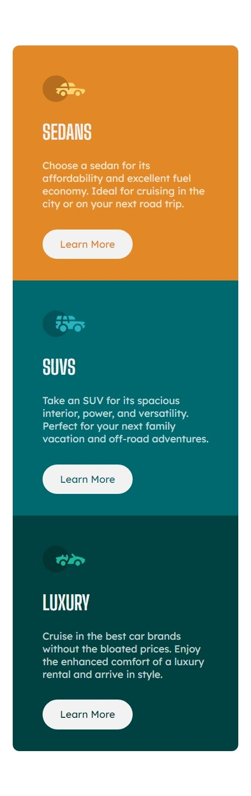
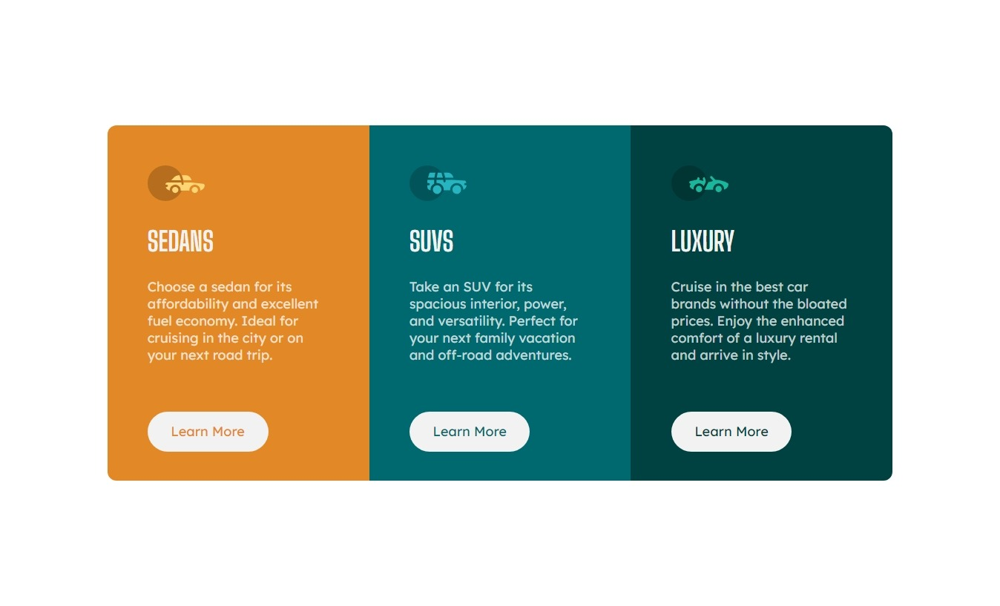

# Frontend Mentor - 3-column preview card component solution

This is a solution to the [3-column preview card component challenge on Frontend Mentor](https://www.frontendmentor.io/challenges/3column-preview-card-component-pH92eAR2-). Frontend Mentor challenges help you improve your coding skills by building realistic projects.

## Table of contents

- [Overview](#overview)
  - [The challenge](#the-challenge)
  - [Screenshots](#screenshot)
  - [Links](#links)
- [My process](#my-process)
  - [Built with](#built-with)
  - [What I learned](#what-i-learned)
  - [Continued development](#continued-development)
- [Author](#author)

## Overview

### The challenge

Users should be able to:

- View the optimal layout depending on their device's screen size
- See hover states for interactive elements

### Screenshots

Mobile:

Desktop:

### Links

- Solution URL: [Add solution URL here](https://your-solution-url.com)
- Live Site URL: [Add live site URL here](https://your-live-site-url.com)

## My process

### Built with

- CSS custom properties
- Flexbox
- CSS Grid
- Mobile-first workflow
- [Angular](https://angular.io/) - JS framework
- [SCSS](https://sass-lang.com/) - CSS preprocessor

### What I learned

I've tried to create a structure of card component to enable to pass just content with styles for font and colours. Unfortunately I couldn't do that because css classes from parent component was overwriting these on ng-content (if there is any way to style them, please send me a DM).
Also I tried to set border-radius for outer container in order to easily set the nice border like it was on design sheets, but it wasn't applying 😞.

### Continued development

I'm really excited to expand my knowledge of Angular, especially Angular Material. From more technical POV I wanna learn more TS for more safety code and not get mad because of mistype during development 🙃

## Author

<!-- - Website - [Norbert Sosnowski](https://www.your-site.com) -->

- Frontend Mentor - [@Eter-NS](https://www.frontendmentor.io/profile/Eter-NS)
- Twitter - [@eter_ns](https://www.twitter.com/eter_ns)
- Linkedin - [Norbert Sosnowski](https://www.linkedin.com/in/norbert-sosnowski-629535197/)

This project was generated with [Angular CLI](https://github.com/angular/angular-cli) version 16.0.5.

## Development server

Run `ng serve` for a dev server. Navigate to `http://localhost:4200/`. The application will automatically reload if you change any of the source files.
